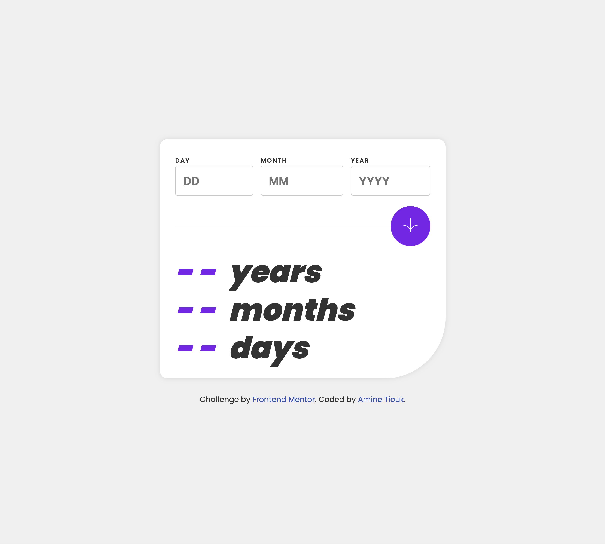

# Frontend Mentor - Age calculator app

## Screenshot

## Built with

- Semantic HTML5 markup
- CSS custom properties
- Flexbox

### What I learned

I learned how to calculate age based on user input and display it dynamically using React state and hooks.
