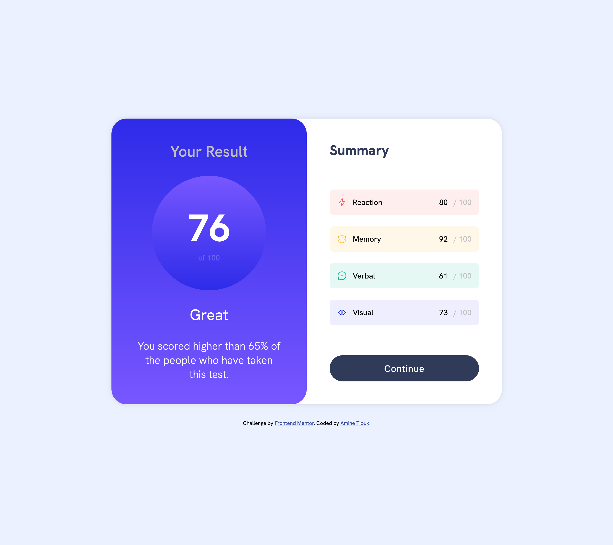

# Frontend Mentor - Results summary component

## Overview

- This is a solution to the Results summary component challenge on Frontend Mentor,
- Frontend Mentor challenges help you improve your coding skills by building realistic projects.

### Screenshot

### Live Site

You can view the live site [here](https://results-summary-two-virid.vercel.app/).

## My process

### Built with

- Semantic HTML5 markup
- CSS custom properties
- Flexbox
- Mobile-first workflow

### Continued development

In future projects, I want to continue improving my skills in responsive design and explore more advanced CSS techniques.
